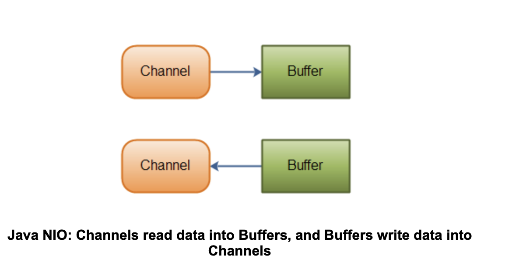
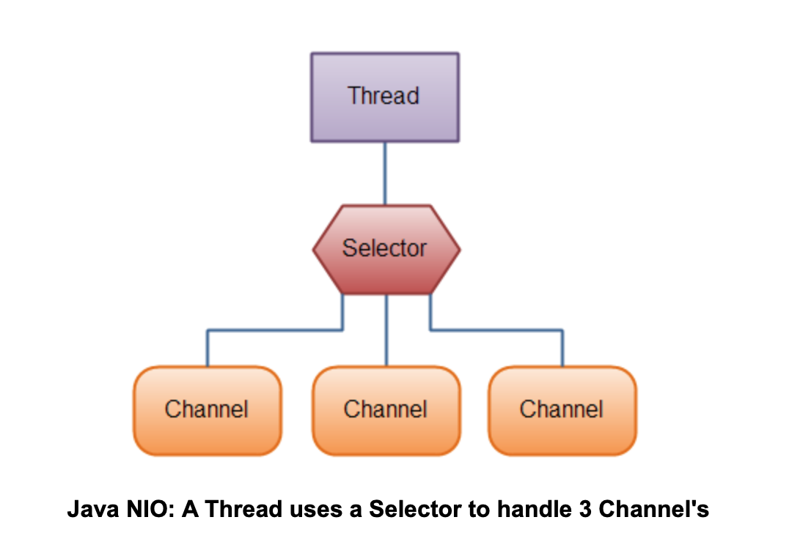
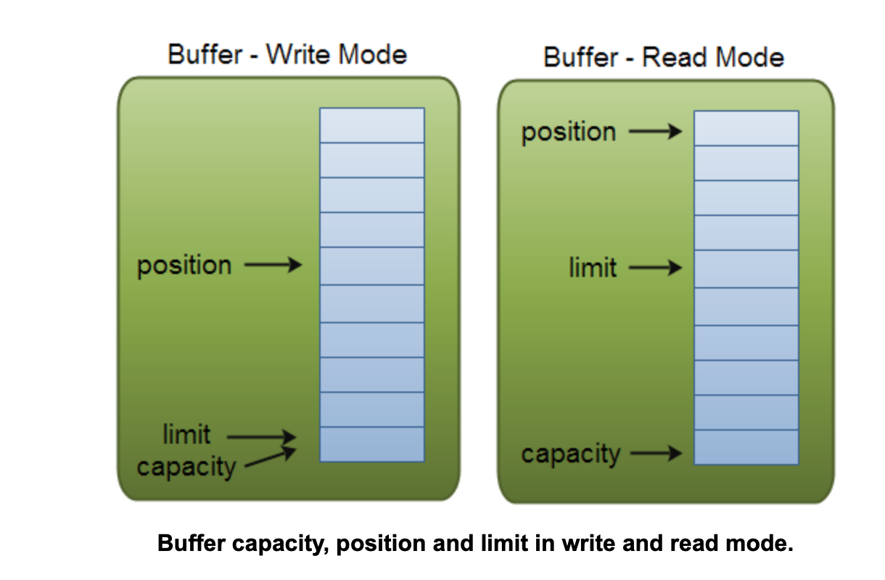

# Java NIO Tutorial
## 一、内容概要
Java NIO（New IO）Java中一个非传统的IO API，这意味着它是标准Java IO和Java Networking API之外的一个新的选择（实际上Java IO已经使用NIO思想重新实现了，见[这篇文章](https://blog.csdn.net/infant09/article/details/80044868)）。Java NIO相对于传统IO API提供一个不同的IO 编程模型。注意：有时NIO也是Non-blocking IO的含义。无论如何，NIO都不是传统的IO，而且，有一部分NIO API实际上也是阻塞的：比如文件API-所以说NIO是“Non-blocking”可能会有点儿轻微的误导性。
### Java NIO:Non-blocking IO
Java NIO可以让你的IO操作变的non-blocking。举个例子，一个线程可以让一个channel把数据读到buffer。当channel往buffer里读数据时，这个线程可以去做其他事情。一旦数据读完，这个线程就可以回过头来继续处理这些数据了。将buffer里的数据写到channel同理。
### Java NIO:Channels and Buffers
在标准的IO API中使用的是Byte streams和character streams。在NIO中使用的则是channels和buffers。数据总是从一个channel读到一个buffer中，或者从一个buffer中写到channel中。
### Java NIO:Selectors
Java NIO 中有一个叫“selectors”的概念。一个selector是一个可以监控多个channel事件的对象（比如：打开连接，数据到达等等）。得益于selector，一个线程就可以监控多个channel的数据。
### Java NIO Concepts
相对于老的Java IO模型，Java NIO有如下新的概念：
* Channels
* Buffers
* Scatter - Gather
* Channel to Channel Transfers
* Selectors
* FileChannel
* SocketChannel
* ServerSocketChannel
* Non-blocking Server Design
* DatagramChannel
* Pipe
* NIO vs. IO
* Path
* Files
* AsynchronousFileChannel

## 二、Java NIO 总览
Java NIO包含如下三个核心部分：
* Channels
* Buffers
* Selectors

Java NIO中的类和组件远不于此，但是我认为是这三个组件组成了Java NIO的核心API。其他类似Pipe和FileLock的组件仅仅是这三个核心组件的连接工具类。因此，这节总览中将专注于介绍这三个组件。

### Channels和Buffers
典型的，所有的NIO中的IO都从一个Channel开始。Channel类似于一个流。通过Channel数据可以读到Buffer。数据也可以从一个Buffer写到Channel里。这里有一个示意图：



Java NIO中Channel的核心实现有：

* FileChannel
* DatagramChannel（UDP）
* SocketChannel
* ServerSocketChannel

正如你看到的，这些Channels包括了UDP+TCP 网络IO，和文件IO。

Java NIO中Buffer的核心实现有：

* ByteBuffer
* CharBuffer
* DoubleBuffer
* FloatBuffer
* IntBuffer
* LongBuffer
* ShortBuffer

这些Buffer覆盖了我们可以发送的一些基础数据类型：byte，short，int，long，float，double和character。

Java NIO包含一个特殊的用来连接内存映射文件（memory mapped files）的buffer：MappedByteBuffer。

### selector

一个Selector允许一个线程去处理多个channel。这对于那些有很多打开的连接Connections（channels），但在每个连接仅有少量流量的应用特别有用。比如，在一个提供聊天功能的服务器里。这里有一个一个线程使用一个selector处理3个channel的示例图：




仅需将channel注册到selector，然后使用selector的select方法就可以使用selector了。selector方法将阻塞线程直到注册在selector上的众多channel发生了一个事件：例如新的连接被打开，接收到数据等。

## 三、Java NIO Channel

Java NIO Channels和流相似但也有些许差别：

* 你可以从Channel读数据也可以往Channel写数据，而Streams只能单向读或者写。
* Channel可以异步读写。
* Channel总是将数据读到Buffer，或从Buffer往Channel里写数据。

正如刚才所说，Channel总是将数据读到Buffer，或从Buffer往Channel里写数据。再次出示相关示意图：


### Channel实现

Java NIO中最重要的几个Channel实现是：

* FileChannel
* DatagramChannel
* SocketChannel
* ServerSocketChannel

FileChannel从文件里读或者往文件里写数据。

DatagramChannel通过UDP读或者写数据。

SocketChannel通过TCP读或者数据。

ServerSocketChannel允许你像一个web server那样监听TCP连接。对于每个连接就创建一个SocketChannel。

### 一个关于Channel的基础例子

这里有一个简单的例子：使用Filechannel将文件里的数据读到buffer。


```java
RandomAccessFile aFile = new RandomAccessFile("data/nio-data.txt", "rw");
    FileChannel inChannel = aFile.getChannel();

    ByteBuffer buf = ByteBuffer.allocate(48);

    int bytesRead = inChannel.read(buf);
    while (bytesRead != -1) {

      System.out.println("Read " + bytesRead);
      buf.flip();

      while(buf.hasRemaining()){
          System.out.print((char) buf.get());
      }

      buf.clear();
      bytesRead = inChannel.read(buf);
    }
    aFile.close();
```

注意buf.flip()被调用了。首先将数据读到Buffer，然后翻转（flip），再将数据读出，再接下来的章节中将会详细介绍关于Buffer的细节。

## 三、Java NIO Buffer

Java NIO Buffers总是和NIO Channels一起使用，正如之前介绍，数据是从channel读到buffer，从buffer写入channel。

一个buffer是必须的一个内存块，这个内存块你可以往里写数据，也可以往外读数据。这个内存块在Java NIO里定义的Buffer对象，它提供了一些可以方便操作这个代码块的方法。

### Buffer的基本使用

使用Buffe去读或者写数据，有四个典型的步骤：

1. 将数据写入Buffer
2. 调用buffer.flip()
3. 从Buffer读取数据
4. 调用buffer.clear()或者buffer.compact()

当你往buffer写数据时，buffer会跟踪你写了多少数据。一旦你需要读数据时，你需要使用flip()将buffer从写模式切换到读模式。在读模式中buffer允许你将读取所有数据然后写入buffer。

一旦你读取了所有数据，你需要清除buffer以将备接下来的写操作。有两种方式可以清除buffer：调用clear()或者调用compact()。clear（）方法将清空整个buffer。compact()方法仅仅清理你刚刚读取的数据。任何未读的数据都被挪到了buffer开始的地方，然后执行写操作后数据时将会写在这些未读的数据之后。

这里有一个Buffe的简单例子，使用write，flip，read和clear操作：

```java
RandomAccessFile aFile = new RandomAccessFile("data/nio-data.txt", "rw");
FileChannel inChannel = aFile.getChannel();

//create buffer with capacity of 48 bytes
ByteBuffer buf = ByteBuffer.allocate(48);

int bytesRead = inChannel.read(buf); //read into buffer.
while (bytesRead != -1) {

  buf.flip();  //make buffer ready for read

  while(buf.hasRemaining()){
      System.out.print((char) buf.get()); // read 1 byte at a time
  }

  buf.clear(); //make buffer ready for writing
  bytesRead = inChannel.read(buf);
}
aFile.close();
```

### Buffer容量，位置和极限（Buffer Capacity, Position and Limit）

一个buffer是必须的一个内存块，这个内存块你可以往里写数据，也可以往外读数据。这个内存块在Java NIO里定义的Buffer对象，它提供了一些可以方便操作这个代码块的方法。

为了理解Buffer如何工作，一个Buffer有三个属性必须熟悉：

* capacity
* position
* limit

position和limit的含义依赖于Buffer是在读模式还是写模式。而Capacity的含义则与Buffer处于何种模式无关。




#### Capacity

作为一个内存块，一个Buffer有一个确认的固定大小：capacity。你可以写对应capacity的诸如bytes，longs，chars到Buffer中，一旦Buffer装满后，想继续写入更多数据就只能clear或者read了（empty it ：read the data, or clear it）。

#### Position

写模式下，写数据需要指定从何处开始写入，即需指定position。positon在初始化状态为0，当写入一个诸如byte，long后，position会前进到写入数据的那个格子的下一个格子。position最大值为capacity-1。

读模式下，读数据需指定从何处开始，即需指定position。当将buffer从写模式切换到读模式时，需翻转（flip）一个Buffer，positon在flip后会重置到0。正如写数据，当读取一个诸如byte，long后，position也会前进到读取数据的那个格子的下一个格子。

#### Limit

写模式下，Buffer的limit是你可以写入多少数据：即Buffer的容量（capacity）。

当翻转（flip）缓存到读模式后，limit是可以从Buffer中读取数据的limit。因此，翻转（flip）缓存到读模式，limit被设置为写模式下的position的值。换言之，你可以读取刚刚写入的所有数据，写入的数据的数量由position标记。

### Buffer类型

Java NIO有以下几个Buffer类型：

* ByteBuffer
* MappedByteBuffer
* CharBuffer
* DoubleBuffer
* FloatBuffer
* IntBuffer
* LongBuffer
* ShortBuffer

正如所见，这些buffer的类型代表了不同的数据类型。换言之，他们让你方便使用这些buffer像使用诸如char，short，int，long，float或者double等基本类型一样。

MappedByteBuffer是一个有点特殊的类型，它是被它自己的内容覆盖的类型（翻译不好：The `MappedByteBuffer` is a bit special, and will be covered in its own text.）。


